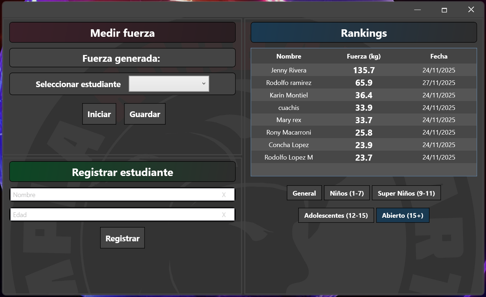

This is a freelance continuation of a project I did for a martial arts business when graduating from my Associate's degree in Mechatronics. You can find the academic presentation here: https://docs.google.com/presentation/d/19fxrKF5VyuEJWEEm1VYVjVhd2IPao7sE/edit?slide=id.p1#slide=id.p1

Spanish version photo:

## 🏋️ StrengthCoach To-Do List

* Add a delete student option.
* Add field to register the type of strike. (This also needs to add ranking filters for each type of strike).
* Add weekly progress ranking filter.
* Add student visualizer and report generator.
* Modify "Start" button properties to better display the `isDisabled` property.
* Add total force produced measuring over a period of time.